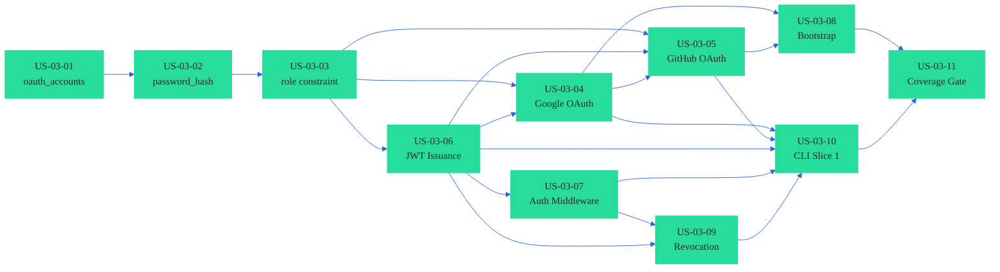

# Epic 03 — Authentication, OAuth, and Session Management

**Version:** 1.1.0
**Phase:** 1
**Status:** Ready for development
**Depends on:** Epic 01 (US-01-11 closed), Epic 02 (US-02-06 closed)

---

## Scope Summary

Delivers the complete authentication, session management, and role enforcement layer for
the Postulate API, plus CLI Slice 1 (login and logout). Project-scoped roles are deferred
to Epic 15.

**Decisions locked:**

- OAuth providers: Google and GitHub only, via Goth
- No email/password authentication — `password_hash` retained but nullable
- JWT: HS256, `golang-jwt/jwt`, 8h TTL
- Refresh token: 30-day TTL, single-use rotation
- Silent refresh window: 30 minutes before expiry
- CLI login: local callback server on loopback port
- Platform roles: `platform_admin` and `platform_member` on `users` table
- Bootstrap: `POSTULATE_BOOTSTRAP_ADMIN_EMAIL`; development fallback on empty database

---

## Coverage Requirements

| Package | Minimum |
|---|---|
| `internal/auth` | 95% line / branch / function |
| `internal/middleware` | 95% line / branch / function |
| `internal/session` | 95% line / branch / function |
| All other packages in this Epic | 90% |

---

## Story Index

| Story ID | Title |
|---|---|
| US-03-01 | Schema Migration — `oauth_accounts` Table |
| US-03-02 | Schema Migration — `users.password_hash` Nullable |
| US-03-03 | Schema Migration — `users.role` Constraint Update |
| US-03-04 | Google OAuth Flow |
| US-03-05 | GitHub OAuth Flow |
| US-03-06 | JWT Session Token Issuance and Refresh |
| US-03-07 | Authentication Middleware |
| US-03-08 | Platform Admin Bootstrap and Role Enforcement |
| US-03-09 | Session Revocation (Logout) |
| US-03-10 | CLI Slice 1 — `postulate login` and `postulate logout` |
| US-03-11 | Epic 03 Coverage Gate and Hardening |

---

## Sequencing

**Critical path:** US-03-01 → US-03-02 → US-03-03 → US-03-06 → US-03-07 → US-03-09 → US-03-10 → US-03-11
